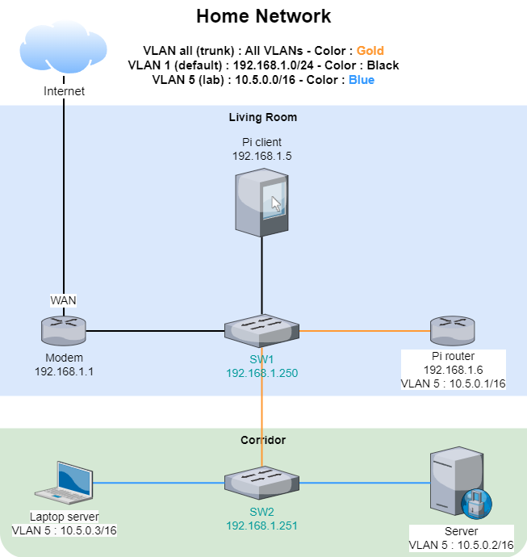

<p align="center">
  
</p>

# RPi as a router - Ansible Playbook

Provision a Raspberry Pi (or any PC) as a router on a stick and enable communication between home and lab network with NAT.

## Why?

I needed a lot of routers, since I had some spare Raspberry Pis, that's what I used.

I created this simple Ansible Playbook to easily _convert_ my RPis without having to type the same commands a thousand times.

## Features

- [x] Prepare the Raspberry Pi from scratch (upgrade, dist-upgrade, network configuration)
- [x] Using a single NIC for both networks (LAN and LAB) to work as a router on a stick
- [x] Defining a VLAN interface
- [x] Defining static IPs for these networks
- [x] NAT enabled from LAB to LAN network
- [x] (hopefully) Optimized Ansible Playbook to install everything with as few tasks as possible
- [x] Easy to use with a single command: `just`

### Limitations

- [x] One RPi at a time because I'm using `group_vars` variables for now and all the hosts would have the same IP - can be fixed if I define, at least, the LAN et LAB IPs inside `host_vars` and create a file for each RPi - this has not been tested yet but it would surely work!

## Infrastructure using this project

Here is an example of infrastructure using a RPi as a _router on a stick_ to bridge home network with lab network :



## Pre-requisites

- A PC/RPi (router) with network access and a single NIC (tested with a Raspberry Pi 4 - 4 GB of RAM)
- Any Debian based distribution (tested with Raspberry Pi OS Lite (64-bit) - Bullseye)
- A PC (client) to execute the playbook from and apply on the RPis (tested with a RPi 4 and Raspberry Pi OS Lite 64-bit - Bullseye)
- 2 networks with hosts in each to test connectivity
- Python 3 (tested with 3.9.2)
- pip (tested with 20.3.4)
- Ansible (tested with 2.14.5)
- [Just](https://github.com/casey/just) (optional)
- Git (duh)

_As a side note, all the Micro SD cards of the RPis were prepared using [`Raspberry Pi Imager`](https://www.raspberrypi.com/software/)_

### Downloading the project

Clone the repository:

```shell
git clone https://github.com/AngeIo/rpi-router-ansible.git
cd rpi-router-ansible
```

To update the source code to the latest commit, run the following command inside the `rpi-router-ansible` directory:

```shell
git pull
```

## Usage

Here are all the steps you have to follow to make this work:

### Variables

The first thing you have to do is editing the variables to match with your environment (comments in the files shows what to edit) :

#### Changing default username to login on RPi
```shell
vi ansible.cfg
```

#### Changing which RPi to target inside the inventory
```shell
vi inventory/all
```

#### Changing variables of the RPi (interface name, IP address, etc.)
```shell
vi group_vars/raspberrypi
```

### Running the Playbook

Running the playbook is very simple:

#### With `just` installed
```shell
just
```

**OR**

#### Without `just` installed
```shell
ansible-playbook -k -D pb_main.yml
```

### End result

Your newly created RPi router should be able to join both networks and, if the gateway (IP in LAB of RPi router) is properly setup on any host inside the lab, they should also communicate with the Internet and LAN/home network!

## Contributing

If you want to contribute to this project, feel free to submit a pull request, I'll be happy to merge it! Everyone is welcome!

## License

*This project*'s code is licensed under [The Unlicense](https://opensource.org/license/unlicense). Please see [the license file](LICENSE) for more information. [tl;dr](https://www.tldrlegal.com/license/unlicense) you can do whatever you want with it, it's public domain.
